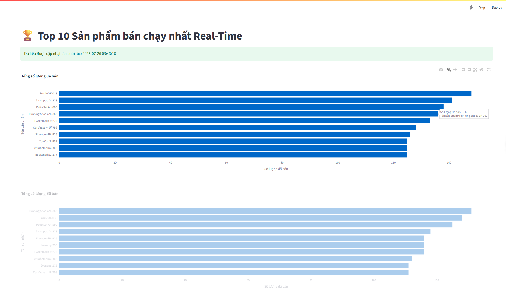
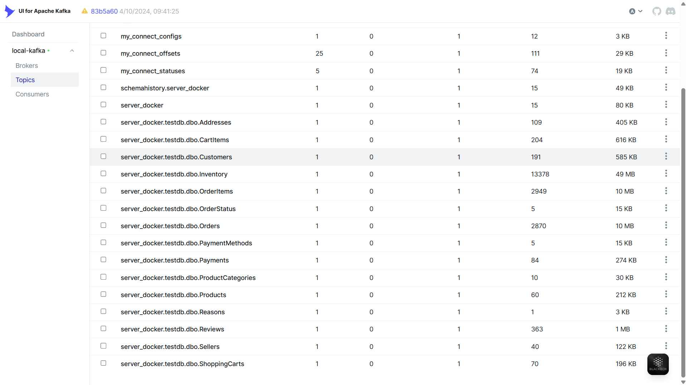
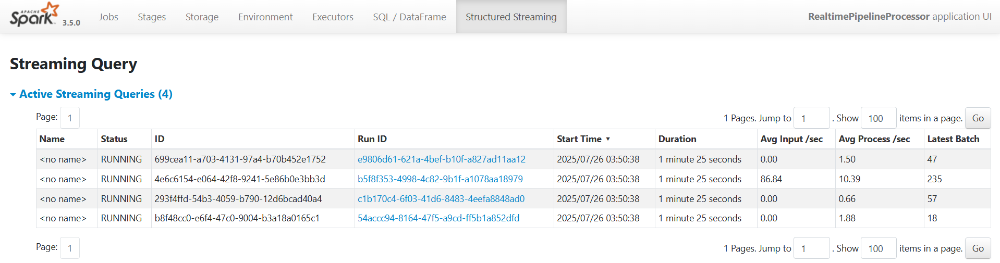

# Real-Time Data Pipeline Platform: From CDC to Interactive Dashboard

## 1. Project Overview

This project demonstrates a complete, end-to-end, modern data platform, simulating the data analytics environment of an e-commerce company. The primary goal is to showcase a robust architecture capable of capturing, processing, and visualizing data in near real-time, moments after it's generated in the source system.

Instead of waiting for nightly or weekly batch reports, this system allows business stakeholders to monitor the "health" of the business minute-by-minute. It showcases an entire workflow, from a new order being recorded in a transactional database to its impact appearing on a revenue chart, all within seconds. This platform is a prime example of a streaming-first **Lakehouse architecture**.

## 2. Project Goals & Key Features

-   **Real-time Change Data Capture (CDC):** Automatically capture every change (INSERT, UPDATE, DELETE) from the source database without altering the original application's logic.
-   **Historical Data Tracking (SCD Type 2):** Build a complete historical record for critical entities (like customers), enabling analysis of behavioral changes over time.
-   **Stateful Stream Processing:** Apply complex processing logic that requires maintaining state across different micro-batches of data.
-   **Lakehouse Architecture on Object Storage:** Utilize Delta Lake on MinIO to combine the cost-effective flexibility of a Data Lake with the reliability and performance of a Data Warehouse.
-   **Interactive, Auto-Refreshing Dashboard:** Provide an intuitive web dashboard (Streamlit) for end-users that automatically updates to reflect the latest data insights.
-   **Fully Containerized Environment:** The entire system is defined and orchestrated using Docker, ensuring consistency and ease of deployment across any environment (local, on-premise, cloud).
-   **Scalable by Design:** The architecture is built on components like Kafka and Spark, allowing it to scale out to handle larger data volumes in the future.

## 3. Architecture Diagram

The system's data flow follows a modern Lakehouse architecture.

```
+----------------+   CDC Events   +--------+   Raw Events   +-----------------+
|                | -------------- |        | -------------- |                 |
|   SQL Server   | (Debezium)     | Kafka  |                | Spark Streaming |
| (OLTP Database)|                |        | (Topics)       | (Processing)    |
|                | <------------- |        | <------------- |                 |
+----------------+   (Data Sink)  +--------+                +-------+---------+
                                                                     |
                                         (Processed Data)            | Write
                                                                     V
+-----------------+                +---------------------------------+
|                 |   Read Data    |                                 |
| Streamlit       | <------------- | MinIO (S3) with Delta Lake      |
| (BI Dashboard)  |                | (Data Lakehouse)                |
|                 |                |                                 |
+-----------------+                +---------------------------------+
```


## 4. Technology Stack

| Category | Technology | Version (Example) | Role in Project |
| :--- | :--- | :--- | :--- |
| **Containerization** | Docker, Docker Compose | v20+ | Packages, defines, and orchestrates all services. |
| **Database** | Microsoft SQL Server | 2019-latest | Source Online Transaction Processing (OLTP) database. |
| **CDC** | Debezium | 2.1 | Captures and streams database changes to Kafka. |
| **Message Queue** | Apache Kafka | cp-7.3.0 | Central hub for ingesting and distributing data events. |
| **Data Processing** | Apache Spark | 3.5.0 | Processes data streams from Kafka, applies business logic, and writes to Delta Lake. |
| **Data Lake** | MinIO, Delta Lake | latest, 3.1.0 | Stores data as structured, versioned Delta tables. |
| **Visualization** | Streamlit | latest | Builds the real-time, interactive web dashboard. |
| **Auxiliary Tools** | Kafka UI, Debezium UI | latest | Web UIs for managing and monitoring Kafka and Debezium. |

## 5. Directory Structure
```
/
├── docker-compose.yml        # 📜 The main file; defines all services, networks, and volumes.
├── spark_apps/               # 👨‍💻 Contains Python scripts for Spark and user interaction.
│   ├── spark_scd2_processor.py # 🧠 The main Spark job; processes 5 data streams and writes to Delta Lake.
│   ├── realtime_faker.py       # 🤖 Script to generate fake data to simulate real-time activity.
│   ├── run_setup.py            # 🏗️ Script for initial database setup (creates tables, enables CDC).
│   └── ...
├── streamlit_app/            # 🖼️ Contains the source code for the Streamlit dashboard.
│   ├── Dockerfile            # 📝 Defines how to build the Streamlit image from the pyspark-notebook base.
│   ├── requirements.txt      # 📦 Python libraries required for the Streamlit app.
│   └── app.py                # 🐍 The main source code for the Streamlit dashboard application.
├── setup_database.sql        # 🗄️ Contains SQL statements for the initial database schema and triggers.
└── README.md                 # 📖 This file.
```

## 6. Detailed Setup & Running Guide

### Prerequisites
-   [Docker Desktop](https://www.docker.com/products/docker-desktop/) is installed and running.
-   On Windows, Docker Desktop should be configured to use the WSL 2 backend.
-   Git for cloning the repository.
-   A stable internet connection to download Docker images and Maven packages.

### Step 1: Clone the Project
```shell
git clone <YOUR_REPOSITORY_URL>
cd <PROJECT_DIRECTORY_NAME>
```

### Step 2: Configure Docker Resources (Important for Windows)
To ensure Docker has enough resources to run all services smoothly, especially Spark, create a `.wslconfig` file in your user profile directory (`C:\Users\<Your_Username>`) with the following content:
```ini
[wsl2]
memory=12GB   # Allocate at least 8GB RAM; 12GB or 16GB is recommended
processors=4  # Allocate at least 4 CPU cores
```
After creating/editing this file, **restart Docker Desktop** for the changes to take effect.

### Step 3: Start the Infrastructure Services
This command will start all background services. The first time you run this, it may take several minutes to download the necessary images.
```shell
docker compose up -d
```
After it finishes, verify that all containers are up and running:
```shell
docker compose ps
```

### Step 4: Set Up the Initial Database
This script will create the tables in SQL Server and, most importantly, enable Change Data Capture (CDC) so Debezium can track them.
```shell
# Connect to the spark-master container, which has the necessary Python environment
docker exec -it spark-master /bin/bash

# Inside the container, install the required Python libraries
pip install pyodbc Faker

# Run the setup script
# It will read the .sql file, connect to SQL Server, and execute the commands
python3 work/run_setup.py
```

### Step 5: Create the Debezium Connector
Send a request to the Debezium Connect API to start monitoring the tables where CDC was enabled.
```shell
# This command can be run from your local machine's terminal or from inside the spark-master container
curl -i -X POST -H "Accept:application/json" -H "Content-Type:application/json" localhost:8083/connectors/ -d '{ "name": "sqlserver-connector", "config": { "connector.class": "io.debezium.connector.sqlserver.SqlServerConnector", "database.hostname": "sqlserver", "database.port": "1433", "database.user": "sa", "database.password": "yourStrong(!)Password", "database.names": "testdb", "topic.prefix": "server_docker", "table.include.list": "dbo.Customers,dbo.Products,dbo.Orders,dbo.OrderItems,dbo.Inventory", "schema.history.internal.kafka.bootstrap.servers": "kafka:29092", "schema.history.internal.kafka.topic": "schemahistory.server_docker", "database.encrypt": "false" } }'
```
A successful request will return `HTTP/1.1 201 Created`.

### Step 6: Run the Spark Streaming Job
Start the main data processing script. This script will run continuously, listening to Kafka and writing data to MinIO.
```shell
# In the terminal for the spark-master container you connected to in Step 4
spark-submit \
--packages org.apache.spark:spark-sql-kafka-0-10_2.12:3.5.0,io.delta:delta-spark_2.12:3.1.0,org.apache.hadoop:hadoop-aws:3.3.4 \
work/spark_scd2_processor.py
```
This terminal will now display the Spark processing logs.

### Step 7: Generate Real-time Data
To see the system in action, open a **new** terminal window and run the data faker script.
```shell
# Open a new terminal and connect to the same container
docker exec -it spark-master /bin/bash

# Run the faker script
python3 work/realtime_faker.py
```
You will see messages indicating that new orders, customers, etc., are being created.

## 7. Accessing the User Interfaces (UIs)
Once all services are running, you can access the various UIs from your local machine's web browser.

### Main Dashboard (Streamlit)
-   **URL:** `http://localhost:8501`
-   **Description:** The primary dashboard, displaying real-time business and inventory metrics.



### MinIO Console (Data Lake)
-   **URL:** `http://localhost:9001`
-   **Credentials:** `minioadmin` / `minioadmin`
-   **Description:** Browse the buckets and data files in your Data Lake. Navigate to the `datalake` bucket to see the `orders`, `products`, `customers_scd2` tables.


### Kafka UI
-   **URL:** `http://localhost:8080`
-   **Description:** Manage topics, view messages as they are produced by Debezium, and monitor the health of the Kafka cluster.



### Spark UI
-   **URL:** `http://localhost:4040`
-   **Description:** A powerful tool to monitor running Spark jobs, inspect execution plans, and debug performance issues.



## 8. Troubleshooting Common Issues
- **`pull access denied` error during `docker compose up`:**
  - This is usually caused by Docker Hub's rate limiting. The most reliable fix is to create a free Docker Hub account and run `docker login` in your terminal.
- **Spark job crashes with `Py4JException` or `OutOfMemoryError`:**
  - This is a resource issue. Ensure you have configured `.wslconfig` (Step 2) and allocated enough memory to Docker Desktop. You can also increase the memory allocated to the Spark driver/executor in the `spark_scd2_processor.py` script.
- **Streamlit dashboard shows `Connection refused` or the container is `unhealthy`:**
  - Check the logs of the Streamlit container with `docker compose logs streamlit-dashboard`. The error often occurs during Spark Session initialization due to resource or network configuration issues.
- **Data is not updating on the dashboard:**
  - Check the pipeline step-by-step: 1. Is the Debezium connector in a `RUNNING` state? 2. Are new messages appearing in the relevant Kafka topic (use Kafka UI)? 3. Is the Spark job processing new batches? 4. Is the data in MinIO being updated (check "Last Modified" timestamps)?

## 9. Future Roadmap
This platform can be extended with many real-world applications:
-   **Recommendation Engine:** Build a new Spark job to calculate and serve real-time product recommendations.
-   **Fraud Detection:** Analyze patterns in the order and payment streams to flag suspicious transactions.
-   **Abandoned Cart Analysis:** Identify products that are frequently left in shopping carts to inform marketing campaigns.
-   **Customer Churn Prediction:** Use the historical data in the `customers_scd2` table to build a machine learning model to predict which customers are at risk of leaving.